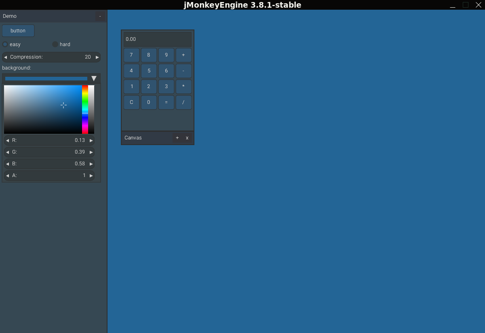

# Nuclear - (Nuklear)

Una biblioteca que proporciona el soporte de JME3 para integrar la biblioteca
de interfaz gráfica de usuario ANSI C mediante los enlaces de LWJGL3. 

El nombre de esta biblioteca biene de un juego de palabras de dos idiomas
en el cual solo cambia la letra K por C, que suenan igual en español.



El backend de la interfaz gráfica se renderiza medinate un post procesado
que ofrece JME3, su arquitectura esta inspirada en el módulo de Nifty que
integra JME.

**Bibliotecas utilizadas**

- JME3
- Nuklear
- LWJGL3

## Construyendo con Nuclear

Nuclear se puede agregar como una dependencia normal usando los archivos jar 
[stable]() o usando 
_**JitPack**_ de la siguiente manera:

**Paso 1. Agregue el repositorio maven de JitPack**

```gradle
    maven { url "https://jitpack.io"  }
```

**Paso 2. Agregue las dependencias necesarias**

```gradle
...
ext {
    lwjglNatives = "natives-linux"
    lwjglVersion = "3.3.6"
}
...

    implementation platform("org.lwjgl:lwjgl-bom:$lwjglVersion")
    implementation "org.lwjgl:lwjgl-nuklear"
    implementation "org.lwjgl:lwjgl-stb"
    
    implementation "org.lwjgl:lwjgl-stb::$lwjglNatives"
    implementation "org.lwjgl:lwjgl-nuklear::$lwjglNatives"
```

**Iniciando Nuclear**

Si es la primera vez que usas Nuclear, puedes consultar algunos de estos recursos 
para guiarte en el uso de esta gran biblioteca.

- [Muestra](./src/test/java/org/nrr/nk/test/NkSimpleApplication.java)
- [Con un estilo de JME3](./src/test/java/org/nrr/nk/test/NkJmeApplication.java)

Si aun no sabes como usar o como funciona Nuklear, puede consular la web de
**Alexander Fox** que a realizado un gran trabajo, explicando como es la lógica
y más.

[Ir la turorial](https://www.thecodingfox.com/nuklear-usage-guide-lwjgl)
